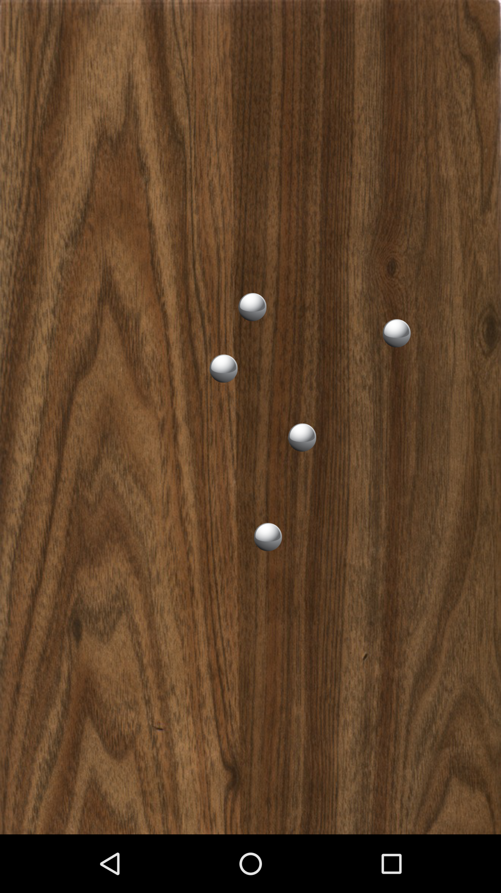

Android AccelerometerPlay Sample
===================================

Sample demonstrating how to use an accelerometer sensor as input for a physics-based view.

Introduction
------------

This sample demonstrates how to use an accelerometer [sensor][1] as input for
a physics-based view. The input from the accelerometer is used to simulate a
virtual surface, and a number of free-moving objects placed on top of it.

Any effects from the device's acceleration vector (including both gravity and
temporary movement) will be translated to the on-screen particles.

[1]: https://developer.android.com/reference/android/hardware/Sensor.html

Pre-requisites
--------------

- Android SDK 23
- Android Build Tools v24.0.0 rc1
- Android Support Repository

Screenshots
-------------

 

Getting Started
---------------

This sample uses the Gradle build system. To build this project, use the
"gradlew build" command or use "Import Project" in Android Studio.
